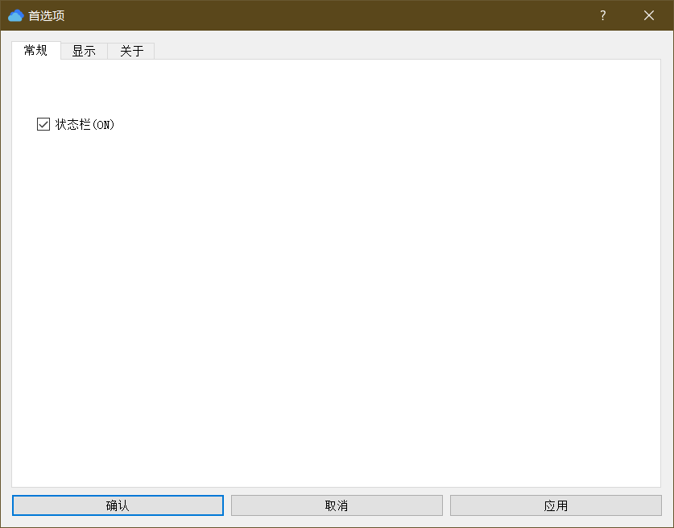
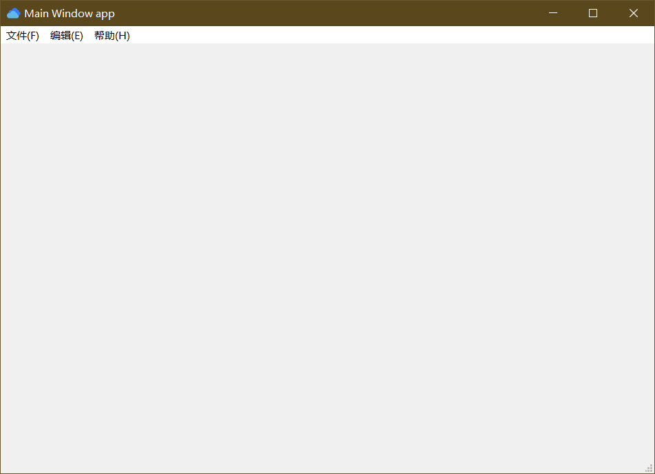

### 用 PyQt5 实现的一个 MainWindow 首选项对话框配置例子，通过配置文件来记录配置，下次启动时会根据配置文件配置程序默认参数
---

### 项目目录结构
---
```
.
├── README.md
├── app1.py
├── config.conf
├── config.py
├── images
│   ├── 3D.png
│   ├── ComingSoonActive_x2.png
│   ├── Connected.png
│   ├── Connected_x2.png
│   ├── ContentType_Part.png
│   ├── Cur_Hand_11_11@2x.png
│   ├── Cur_Hand_11_11@3to2x.png
│   ├── Cur_Hand_11_11@3x.png
│   ├── category-searchengines.png
│   ├── cowboy_hat.png
│   ├── css.png
│   ├── dlg_png.res
│   ├── earthmenu.png
│   ├── email.png
│   └── explode.png
├── setting_dialog.py
└── settings.ui

1 directory, 22 files
```
例子中用Qt Designer 设计了一个首选项配置对话框 settings.ui > setting_dialog.py。



主程序文件是 app1.py

### 安装 & 运行
---

安装 PyQt5 与 PyQt5-tools

```
pip install PyQt5
pip install PyQt5-tools
```

运行：`python app1.py`

---


### config.py 文件
---
config.py 文件里边写了几个解析 config.conf 的函数，这样在 app1.py 里边就可以减少代码，减小耦合度。解析配置文件用的是 Python 内置的 `configparser`  模块。
